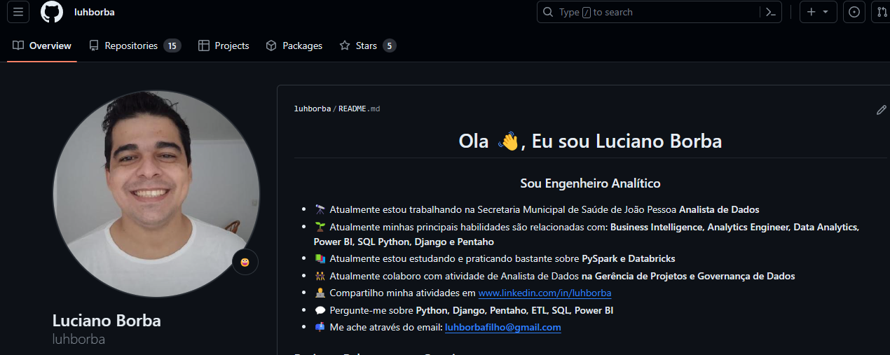

# Bem Vindo a minha documentação

## Funções de Texto

Vou digitar em **negrito**<br>
Agora em *italico*<br>
Quero destacar que o ==MKDOCS== é muito bom

## Funções de Código

Quero mostrar um trecho de código `print('Este é um Teste')`
Quero mostrar um código completo
```{.py3 title="arquivo.py" linenums="55"}
def funcao():
    print('estou com sono')
    return True
```

## Links

Vou colocar 3 links para você me achar:<br>
[GitHub](https://github.com/luhborba)<br>
[LinkedIn](https://www.linkedin.com/in/luhborba/)<br>
[Youtube](https://www.youtube.com/@luhborba)<br>

## Lista não ordenada

- Pão com café
- Dormir
- Tomar Banho
- Fazer Suco
- Reunião as 13hrs

## Lista ordenada

1. Acordar
2. Abrir o olho
3. Se espreguiçar

## Colocando uma imagem



## Tabelas

|Nome|Idade|
|----|-----|
|Luciano|28|
|Maria Clara|11|
|Gabirel|8|
|Maria Julia|4|

## Emoji

:snake: :rocket:

## Lista de Tarefas

- [ ] Tomar Banho
- [x] Gravar um Vídeo
- [x] Testar MKDocs

## Commands

* `mkdocs new [dir-name]` - Create a new project.
* `mkdocs serve` - Start the live-reloading docs server.
* `mkdocs build` - Build the documentation site.
* `mkdocs -h` - Print help message and exit.

## Project layout

    mkdocs.yml    # The configuration file.
    docs/
        index.md  # The documentation homepage.
        ...       # Other markdown pages, images and other files.
